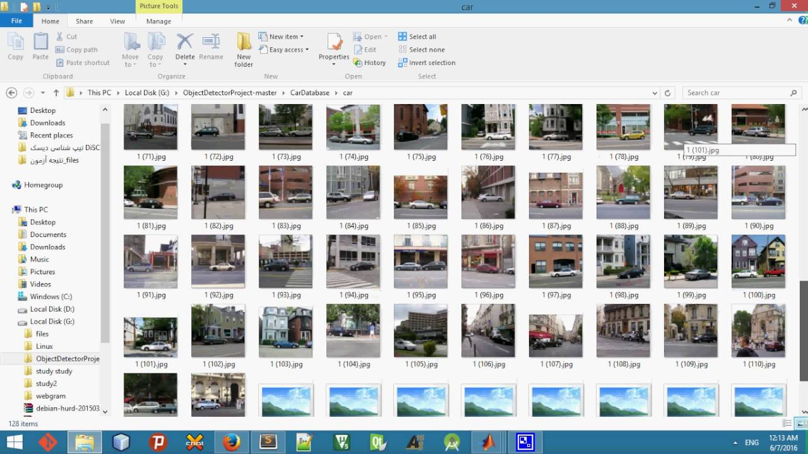

**ObjectDetectorProject**

 This project created in summer (period june,july,agust 2015) for Shiraz University Bachelor Project. I use a data base images (found on internet images),to train new model Side Car Detection,i add in files projects model face,nose and .In this project 
We also use c++ to detect Side Car By webcam.(OPENCV 2.4.9) Finally we use OPENCV4Android,and we create a app for android to
detect Side Car. If you create new model from a new object ,the xml file and data base send me to add this project.for more information go to help in this project.

###### Car Detection,Side Car Detection,Object Detection,Face Detection,Matlab,OPENCV,Android(summary project)

**Licenses**

This project published under LICENSE GPL v3.0. with addition a condition:
when you use object detector for creating  new model, you should send your model and database images (stackprogramer@gmail.com) for sharing on this project.we we share this file model and database with your name on this project.

---
**Snapshots of  the project**

---

**More info**

[help](https://raw.githubusercontent.com/stackprogramer/ObjectDetectorProject/master/help.pdf)

soon i will add  Qt project opencv apk and ios application 

**Youtube video**

Best regards

stackprogramer@gmail.com June - July 2015
